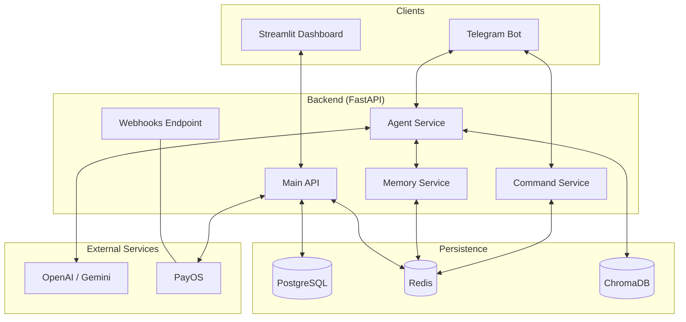
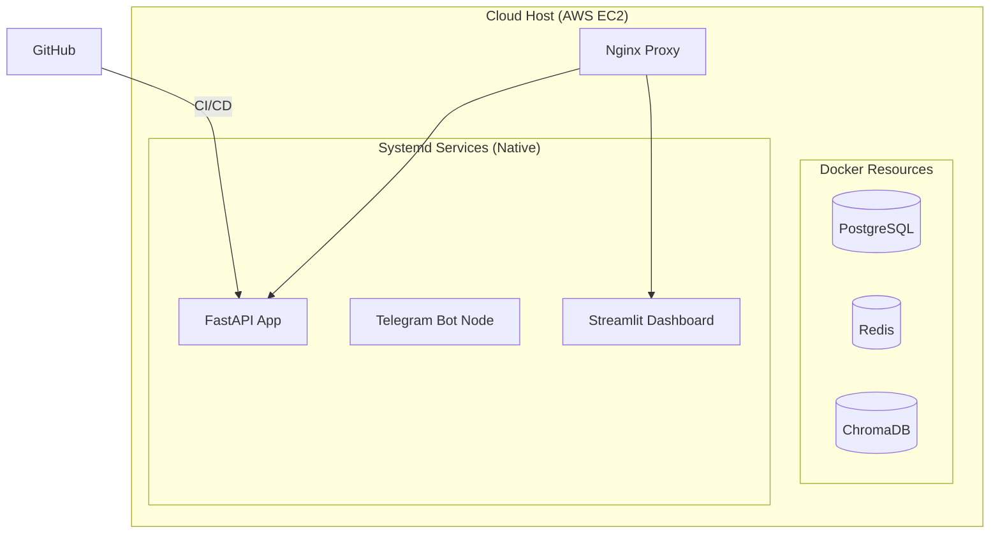

# MoMiChat Architecture

MoMiChat is a modular, AI-first retail platform designed for small merchants. It clones the merchant's persona ("Mom") using Large Language Models to handle complex customer interactions, order processing, and automated payments.

## System Overview

## Hybrid Production Infrastructure

MoMiChat utilizes a optimized hybrid model for performance and ease of management.

### Why Hybrid?
- **Infra in Docker**: Database and cache layers are easily versioned and kept isolated.
- **Apps in Systemd**: Application services run natively using `uv run`, allowing for instant restarts, direct host resource access, and simplified logging via `journalctl`.

## Component Breakdown

### 1. AI Agent (`src/momichat/ai`)
- **Knowledge Base**: Semantic menu search via `sentence-transformers`.
- **Agent Logic**: LangGraph orchestration with JSON-structured interactive buttons.

### 2. Services (`src/momichat/services`)
- **Memory Service**: Redis-based session history preservation.
- **Command Service**: High-speed interceptor for slash commands.
- **Payment Service**: PayOS SDK integration for real-time QR generation.

### 3. Adapters (`src/momichat/adapters`)
- **Telegram Adapter**: Handles message delivery, owner notifications, and rich media (including direct QR code images).
